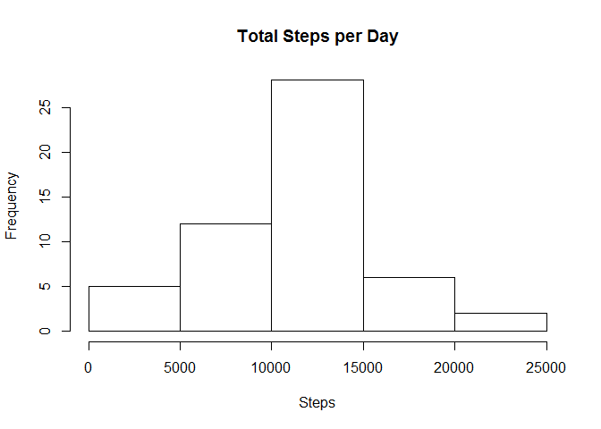
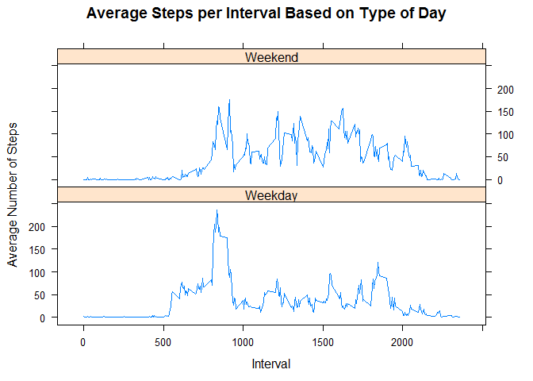

------------------------------------------------------------------------

title: "Reproducible Research: Peer Assessment 1"

    ## First, we need to install the required packages
    #install.packages("dplyr")
    install.packages("Hmisc")

    library(scales)
    library(Hmisc)
    #library(dplyr)

Loading and preprocessing the data
----------------------------------

##### 1. Load the data (i.e. read.csv())

    if(!file.exists('activity.csv')){
        unzip('activity.zip')
    }
    activityData <- read.csv('activity.csv')

##### 2. Process/transform the data (if necessary) into a format suitable for your analysis

    activityDataCleaned <- mutate(activityData, dateCleaned = as.POSIXct(activityData$date, format = "%Y-%m-%d"))

    # Addind a new field - day
    activityDataCleaned$day <- weekdays(as.Date(activityDataCleaned$date))
    head(activityDataCleaned)

    ##   steps       date interval dateCleaned         day
    ## 1    NA 2012-10-01        0  2012-10-01 понедельник
    ## 2    NA 2012-10-01        5  2012-10-01 понедельник
    ## 3    NA 2012-10-01       10  2012-10-01 понедельник
    ## 4    NA 2012-10-01       15  2012-10-01 понедельник
    ## 5    NA 2012-10-01       20  2012-10-01 понедельник
    ## 6    NA 2012-10-01       25  2012-10-01 понедельник

What is mean total number of steps taken per day?
-------------------------------------------------

### Calculate the total number of steps taken per day

    ### summarizing total steps per date
    sumTable <- aggregate(activityDataCleaned$steps ~ activityDataCleaned$dateCleaned, FUN=sum, )
    colnames(sumTable)<- c("Date", "Steps")

##### 1. Make a histogram of the total number of steps taken each day

    hist(sumTable$Steps, breaks=5, xlab="Steps", main = "Total Steps per Day")

##### 2. Calculate and report the mean and median total number of steps taken per day

    stepsByDayMean <- as.integer(mean(sumTable$Steps))
    stepsByDayMedian <- as.integer(median(sumTable$Steps))

-   Mean: 10766
-   Median: 10765

What is the average daily activity pattern?
-------------------------------------------

### Make a time series plot (i.e. type = “l”) of the 5-minute interval (x-axis) and the average number of steps taken, averaged across all days (y-axis)

    ##pulling data without nas
    clean <- activityDataCleaned[!is.na(activityDataCleaned$steps),]

    ##create average number of steps per interval
    intervalTable <- ddply(clean, .(interval), summarize, Avg = mean(steps))
    head(intervalTable)

    ##   interval       Avg
    ## 1        0 1.7169811
    ## 2        5 0.3396226
    ## 3       10 0.1320755
    ## 4       15 0.1509434
    ## 5       20 0.0754717
    ## 6       25 2.0943396

##### 1. Make a time series plot

    ##Create line plot of average number of steps per interval
    p <- ggplot(intervalTable, aes(x=interval, y=Avg), xlab = "Interval", ylab="Average Number of Steps")
    p + geom_line()+xlab("Interval")+ylab("Average Number of Steps")+ggtitle("Average Number of Steps per Interval")

\#\#\#\#\# 2. Which 5-minute interval, on average across all the days in
the dataset, contains the maximum number of steps?

    ##Maximum steps by interval
    maxSteps <- max(intervalTable$Avg)
    ##Which interval contains the maximum average number of steps
    timeMostSteps <- intervalTable[intervalTable$Avg==maxSteps,1]
    maxSteps

    ## [1] 206.1698

-   The maximum number of steps for a 5-minute interval: 206
-   Most Steps at: 835 interval

Imputing missing values
-----------------------

##### 1. Calculate and report the total number of missing values in the dataset

    ##Number of NAs in original data set
    numMissingValues <- nrow(activityDataCleaned[is.na(activityDataCleaned$steps),])

-   Number of missing values: 2304

##### 2. Devise a strategy for filling in all of the missing values in the dataset.

##### My strategy for filling in NAs will be to substitute the missing steps with the average 5-minute interval based on the day of the week.

    ## Create the average number of steps per weekday and interval
    avgTable <- ddply(clean, .(interval, day), summarize, Avg = mean(steps))

    ## Create dataset with all NAs for substitution
    nadata<- activityDataCleaned[is.na(activityDataCleaned$steps),]
    ## Merge NA data with average weekday interval for substitution
    newdata<-merge(nadata, avgTable, by=c("interval", "day"))

##### 3. Create a new dataset that is equal to the original dataset but with the missing data filled in.

    ## Reorder the new substituded data in the same format as clean data set
    newdata2<- newdata[,c(6,4,1,5,2)]

    colnames(newdata2)<- c("steps", "date", "interval", "dateCleaned", "day")

    ##Merge the NA averages and non NA data together
    mergeData <- rbind(clean, newdata2)

##### 4. Make a histogram of the total number of steps taken each day

    ##Create sum of steps per date to compare with step 1
    sumTable2 <- aggregate(mergeData$steps ~ mergeData$date, FUN=sum, )
    colnames(sumTable2)<- c("Date", "Steps")

    ## Mean of Steps with NA data taken care of
    stepsByDayMeanImputed <- as.integer(mean(sumTable2$Steps))

    ## Median of Steps with NA data taken care of
    stepsByDayMedianImputed <- as.integer(median(sumTable2$Steps))

-   Mean (Imputed): 10821
-   Median (Imputed): 11015

<!-- -->

    ## Creating the histogram of total steps per day, categorized by data set to show impact
    hist(sumTable2$Steps, breaks=5, xlab="Steps", main = "Total Steps per Day with NAs Fixed", col="Black")
    hist(sumTable$Steps, breaks=5, xlab="Steps", main = "Total Steps per Day with NAs Fixed", col="Grey", add=T)
    legend("topright", c("Imputed Data", "Non-NA Data"), fill=c("black", "grey") )

Are there differences in activity patterns between weekdays and weekends?
-------------------------------------------------------------------------

##### 1. Create a new factor variable in the dataset with two levels – “weekday” and “weekend” indicating whether a given date is a weekday or weekend day.

    ## Create new category based on the days of the week
    mergeData$DayCategory <- ifelse(mergeData$day %in% c("суббота", "воскресенье"), "Weekend", "Weekday")

    ## Summarize data by interval and type of day
    intervalTable2 <- ddply(mergeData, .(interval, DayCategory), summarize, Avg = mean(steps))

    ##Plot data in a panel plot
    xyplot(Avg~interval|DayCategory, data=intervalTable2, type="l",  layout = c(1,2),
           main="Average Steps per Interval Based on Type of Day", 
           ylab="Average Number of Steps", xlab="Interval")

